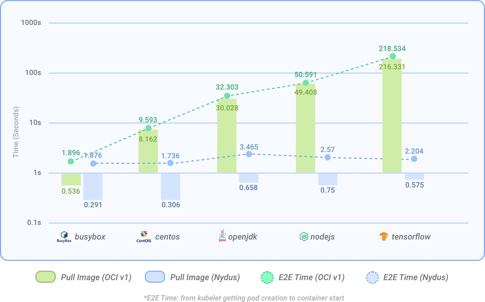

# Nydus: Dragonfly Container Image Service

<p></p>

The nydus project implements a user space filesystem on top of a container image format that improves over the current OCI image specification, in terms of container launching speed, image space, and network bandwidth efficiency, as well as data integrity.

The following benchmarking result shows the performance improvement compared with the OCI image for the container cold startup elapsed time on containerd. As the OCI image size increases, the container startup time of using Nydus image remains very short.



Nydus' key features include:

- Container images are downloaded on demand
- Chunk level data deduplication
- Flatten image metadata and data to remove all intermediate layers
- Only usable image data is saved when building a container image
- Only usable image data is downloaded when running a container
- End-to-end image data integrity
- Compatible with the OCI artifacts spec and distribution spec
- Integrated with existing CNCF project Dragonfly to support image distribution in large clusters
- Different container image storage backends are supported

Currently the repository includes following tools:

- A `nydusify` tool to convert an OCI format container image into a nydus format container image
- A `containerd-nydus-grpc` daemon to serve as containerd remote snapshotter and setup container rootfs with nydus
- A `nydus-image` tool to convert an unpacked container image into a nydus format image
- A `nydusd` daemon to parse a nydus format image and expose a FUSE mountpoint for containers to access

## Build Binary

```shell
# build debug binary
make
# build release binary
make release
# build static binary with docker
make docker-static
```

## Build Nydus Image

Build Nydus image from directory source: [Nydus Image Builder](./docs/nydus-image.md).

Convert OCI image to Nydus image: [Nydusify](./docs/nydusify.md).

## Build Nydus Snapshotter

Build and run Nydus snapshotter: [Nydus Snapshotter](./contrib/nydus-snapshotter/README.md)

## Run Nydusd Daemon

Run Nydusd Daemon to serve Nydus image: [Nydusd](./docs/nydusd.md).

## Learn Concepts and Commands

Browse the documentation to learn more. Here are some topics you may be interested in:

- [A Nydus Tutorial for Beginners](./docs/tutorial.md)
- Our talk on Open Infra Summit 2020: [Toward Next Generation Container Image](https://drive.google.com/file/d/1LRfLUkNxShxxWU7SKjc_50U0N9ZnGIdV/view)
- [Nydus Design Doc](./docs/nydus-design.md)

## Community

Welcome to share your use cases and contribute to Nydus project.
You can reach the community via Dingtalk and Slack

Any bug report, feature requirement, and technique discussion and cooperation are welcomed and expected!

- Slack

  Join our Slack [workspace](https://join.slack.com/t/nydusimageservice/shared_invite/zt-pz4qvl4y-WIh4itPNILGhPS8JqdFm_w)

- Dingtalk

  Join nydus-devel group by clicking [URL](https://qr.dingtalk.com/action/joingroup?code=v1,k1,YfGzhaTOnpm10Bf+/ohz4WcuDEIe9nTIjo+MPuIgRGQ=&_dt_no_comment=1&origin=11) from your phone.

  You can also search our talking group by number _34971767_ and QR code


