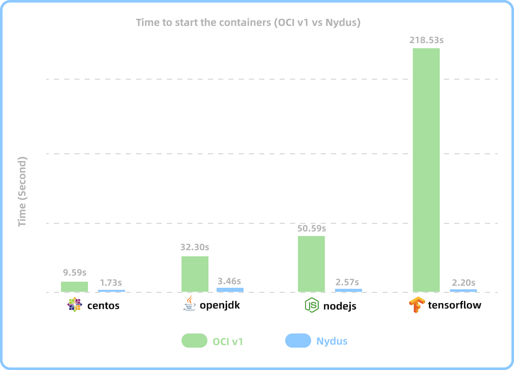

# Nydus: Dragonfly Container Image Service

<p></p>

[](https://github.com/dragonflyoss/image-service/releases)
[](https://crates.io/crates/nydus-rs)

[](https://github.com/dragonflyoss/image-service/actions/workflows/ci.yml)
[](https://github.com/dragonflyoss/image-service/actions/workflows/convert.yml)
[](https://github.com/dragonflyoss/image-service/actions/workflows/release.yml)
[](https://twitter.com/dragonfly_oss)
[](https://github.com/dragonflyoss/image-service)

## Introduction
The nydus project implements a content-addressable filesystem on top of a RAFS format that improves the current OCI image specification, in terms of container launching speed, image space, and network bandwidth efficiency, as well as data integrity.

The following benchmarking result shows the performance improvement compared with the OCI image for the container cold startup elapsed time on containerd. As the OCI image size increases, the container startup time of using Nydus image remains very short.



Nydus' key features include:

- Container images can be downloaded on demand in chunks for lazy pulling to boost container startup
- Chunk-based content-addressable data de-duplication to minimize storage, transmission and memory footprints
- Merged filesystem tree in order to remove all intermediate layers as an option
- in-kernel EROFS or FUSE filesystem together with overlayfs to provide full POSIX compatibility
- E2E image data integrity check. So security issues like "Supply Chain Attach" can be avoided and detected at runtime
- Compatible with the OCI artifacts spec and distribution spec, so nydus image can be stored in a regular container registry
- Native [eStargz](https://github.com/containerd/stargz-snapshotter) image support with remote snapshotter plugin `nydus-snapshotter` for containerd runtime.
- Various container image storage backends are supported. For example, Registry, NAS, Aliyun/OSS, S3.
- Integrated with CNCF incubating project Dragonfly to distribute container images in P2P fashion and mitigate the pressure on container registries
- Capable to prefetch data block before user IO hits the block thus to reduce read latency
- Record files access pattern during runtime gathering access trace/log, by which user abnormal behaviors are easily caught
- Access trace based prefetch table
- User I/O amplification to reduce the amount of small requests to storage backend.

Currently Nydus includes following tools:

| Tool                                                                                                 | Description                                                                                                                                                |
| ---------------------------------------------------------------------------------------------------- | ---------------------------------------------------------------------------------------------------------------------------------------------------------- |
| [nydusd](https://github.com/dragonflyoss/image-service/blob/master/docs/nydusd.md)                   | Nydus user-space daemon, it processes all fscache/FUSE messages from the kernel and parses Nydus images to fullfil those requests                          |
| [nydus-image](https://github.com/dragonflyoss/image-service/blob/master/docs/nydus-image.md)         | Convert a single layer of OCI format container image into a nydus format container image generating meta part file and data part file respectively         |
| [nydusify](https://github.com/dragonflyoss/image-service/blob/master/docs/nydusify.md)               | It pulls OCI image down and unpack it, invokes `nydus-image create` to convert image and then pushes the converted image back to registry and data storage |
| [nydusctl](https://github.com/dragonflyoss/image-service/blob/master/docs/nydus-image.md)            | Nydusd CLI client (`nydus-image inspect`), query daemon's working status/metrics and configure it                                                          |
| [ctr-remote](https://github.com/dragonflyoss/image-service/tree/master/contrib/ctr-remote)           | An enhanced `containerd` CLI tool enable nydus support with `containerd` ctr                                                                               |
| [nydus-docker-graphdriver](https://github.com/nydusaccelerator/docker-nydus-graphdriver)             | [Experimental] Works as a `docker` remote graph driver to control how images and containers are stored and managed                                         |
| [nydus-overlayfs](https://github.com/dragonflyoss/image-service/tree/master/contrib/nydus-overlayfs) | `Containerd` mount helper to invoke overlayfs mount with tweaking mount options a bit. So nydus prerequisites can be passed to vm-based runtime            |
| [nydus-backend-proxy](./contrib/nydus-backend-proxy/README.md)                                       | A simple HTTP server to serve local directory as a blob backend for nydusd                                                                                 |

Currently Nydus is supporting the following platforms in container ecosystem:

| Type          | Platform                                                                                                        | Description                                                                                                                                                  | Status |
| ------------- | --------------------------------------------------------------------------------------------------------------- | ------------------------------------------------------------------------------------------------------------------------------------------------------------ | ------ |
| Storage       | Registry/OSS/S3/NAS                                                                                             | Support for OCI-compatible distribution implementations such as Docker Hub, Harbor, Github GHCR, Aliyun ACR, NAS, and Aliyun OSS-like object storage service | ✅      |
| Storage/Build | [Harbor](https://github.com/goharbor/acceleration-service)                                                      | Provides a general service for Harbor to support acceleration image conversion based on kinds of accelerator like Nydus and eStargz etc                      | ✅      |
| Distribution  | [Dragonfly](https://github.com/dragonflyoss/Dragonfly2)                                                         | Improve the runtime performance of Nydus image even further with the Dragonfly P2P data distribution system                                                  | ✅      |
| Build         | [Buildkit](https://github.com/moby/buildkit/blob/master/docs/nydus.md)                                          | Provides the ability to build and export Nydus images directly from Dockerfile                                                                               | ✅      |
| Runtime       | Kubernetes                                                                                                      | Run Nydus image using CRI interface                                                                                                                          | ✅      |
| Runtime       | [Containerd](https://github.com/containerd/nydus-snapshotter)                                                   | Nydus Snapshotter, a containerd remote plugin to run Nydus image                                                                                             | ✅      |
| Runtime       | [CRI-O / Podman](https://github.com/containers/nydus-storage-plugin)                                            | Run Nydus image with CRI-O or Podman                                                                                                                         | 🚧      |
| Runtime       | [Docker](https://github.com/nydusaccelerator/docker-nydus-graphdriver)                                          | [Experimental] Run Nydus image in Docker container with graphdriver plugin                                                                                   | 🚧      |
| Build/Runtime | [Nerdctl](https://github.com/containerd/nerdctl/blob/master/docs/nydus.md)                                      | The containerd client to build or run (requires nydus snapshotter) Nydus image                                                                               | ✅      |
| Runtime       | [KataContainers](https://github.com/kata-containers/kata-containers/blob/main/docs/design/kata-nydus-design.md) | Run Nydus image in KataContainers as a native solution                                                                                                       | ✅      |
| Runtime       | [EROFS](https://www.kernel.org/doc/html/latest/filesystems/erofs.html)                                          | Run Nydus image directly in-kernel EROFS for even greater performance improvement                                                                            | ✅      |

To try nydus image service:

1. Convert an original OCI image to nydus image and store it somewhere like Docker/Registry, NAS, Aliyun/OSS or S3. This can be directly done by `nydusify`. Normal users don't have to get involved with `nydus-image`.
2. Get `nydus-snapshotter`(`containerd-nydus-grpc`) installed locally and configured properly. Or install `nydus-docker-graphdriver` plugin.
3. Operate container in legacy approaches. For example, `docker`, `nerdctl`, `crictl` and `ctr`.

## Build Binary

```shell
# build debug binary
make
# build release binary
make release
# build static binary with docker
make docker-static
```

## Quick Start with Kubernetes and Containerd

For more details on how to lazily start a container with `nydus-snapshotter` and nydus image on Kubernetes nodes or locally use `nerdctl` rather than CRI, please refer to [Nydus Setup](./docs/containerd-env-setup.md)

## Build Nydus Image

Build Nydus image from directory source: [Nydus Image Builder](./docs/nydus-image.md).

Convert OCIv1 image to Nydus image: [Nydusify](./docs/nydusify.md), [Acceld](https://github.com/goharbor/acceleration-service) or [Nerdctl](https://github.com/containerd/nerdctl/blob/master/docs/nydus.md#build-nydus-image-using-nerdctl-image-convert).

## Nydus Snapshotter

Nydus-snapshotter is a non-core sub-project of containerd.

Check out its code and tutorial from [Nydus-snapshotter repository](https://github.com/containerd/nydus-snapshotter).
It works as a `containerd` remote snapshotter to help setup container rootfs with nydus images, which handles nydus image format when necessary. When running without nydus images, it is identical to the containerd's builtin overlayfs snapshotter.

## Run Nydusd Daemon

Normally, users do not need to start `nydusd` by hand. It is started by `nydus-snapshotter` when a container rootfs is prepared.

Run Nydusd Daemon to serve Nydus image: [Nydusd](./docs/nydusd.md).

## Run Nydus with in-kernel EROFS filesystem

In-kernel EROFS has been fully compatible with RAFS v6 image format since Linux 5.16. In other words, uncompressed RAFS v6 images can be mounted over block devices since then.

Since [Linux 5.19](https://lwn.net/Articles/896140), EROFS has added a new file-based caching (fscache) backend. In this way, compressed RAFS v6 images can be mounted directly with fscache subsystem, even such images are partially available. `estargz` can be converted on the fly and mounted in this way too.

Guide to running Nydus with fscache: [Nydus-fscache](./docs/nydus-fscache.md)

## Run Nydus with Dragonfly P2P system

Nydus is deeply integrated with [Dragonfly](https://d7y.io/) P2P system, which can greatly reduce the network latency and the single point of network pressure for registry server, testing in the production environment shows that using Dragonfly can reduce network latency by more than 80%, to understand the performance test data and how to configure Nydus to use Dragonfly, please refer to the [doc](https://d7y.io/docs/setup/integration/nydus).

## Accelerate OCI image directly with Nydus

Nydus is able to generate a tiny artifact called a `nydus zran` from an existing OCI image in the short time. This artifact can be used to accelerate the container boot time without the need for a full image conversion. For more information, please see the [documentation](./docs/nydus-zran.md).

## Build Images via Harbor

Nydus cooperates with Harbor community to develop [acceleration-service](https://github.com/goharbor/acceleration-service) which provides a general service for Harbor to support image acceleration based on kinds of accelerators like Nydus, eStargz, etc.

## Run with Docker

A **experimental** plugin helps to start Docker container from nydus image. For more particular instructions, please refer to [Docker Nydus Graph Driver](https://github.com/nydusaccelerator/docker-nydus-graphdriver)

## Run with macOS

Nydus can also run with macfuse(a.k.a osxfuse).For more details please read [nydus with macOS](./docs/nydus_with_macos.md).

## Run eStargz image (with lazy pulling)

The containerd remote snapshotter plugin [nydus-snapshotter](https://github.com/containerd/nydus-snapshotter) can be used to run nydus images, or to run [eStargz](https://github.com/containerd/stargz-snapshotter) images directly by appending `--enable-stargz` command line option.

In the future, `zstd::chunked` can work in this way as well.

## Reuse Nydus Services

Using the key features of nydus as native in your project without preparing and invoking `nydusd` deliberately, [nydus-service](./service/README.md) helps to reuse the core services of nyuds.


## Documentation

Browse the documentation to learn more. Here are some topics you may be interested in:

- [A Nydus Tutorial for Beginners](./docs/tutorial.md)
- [Nydus Design Doc](./docs/nydus-design.md)
- Our talk on Open Infra Summit 2020: [Toward Next Generation Container Image](https://drive.google.com/file/d/1LRfLUkNxShxxWU7SKjc_50U0N9ZnGIdV/view)
- [EROFS, What Are We Doing Now For Containers?](https://static.sched.com/hosted_files/kccncosschn21/fd/EROFS_What_Are_We_Doing_Now_For_Containers.pdf)
- [The Evolution of the Nydus Image Acceleration](https://d7y.io/blog/2022/06/06/evolution-of-nydus/) \([Video](https://youtu.be/yr6CB1JN1xg)\)
- [Introduction to Nydus Image Service on In-kernel EROFS](https://static.sched.com/hosted_files/osseu2022/59/Introduction%20to%20Nydus%20Image%20Service%20on%20In-kernel%20EROFS.pdf) \([Video](https://youtu.be/2Uog-y2Gcus)\)

## Community

Nydus aims to form a **vendor-neutral opensource** image distribution solution to all communities.
Questions, bug reports, technical discussion, feature requests and contribution are always welcomed!

We're very pleased to hear your use cases any time.
Feel free to reach/join us via Slack and/or Dingtalk.

- **Slack:** [Nydus Workspace](https://join.slack.com/t/nydusimageservice/shared_invite/zt-pz4qvl4y-WIh4itPNILGhPS8JqdFm_w)

- **Twitter:** [@dragonfly_oss](https://twitter.com/dragonfly_oss)

- **Dingtalk:** [34971767](https://qr.dingtalk.com/action/joingroup?code=v1,k1,ioWGzuDZEIO10Bf+/ohz4RcQqAkW0MtOwoG1nbbMxQg=&_dt_no_comment=1&origin=11)


- **Technical Meeting:** Every Wednesday at 06:00 UTC (Beijing, Shanghai 14:00), please see our [HackMD](https://hackmd.io/@Nydus/Bk8u2X0p9) page for more information.
