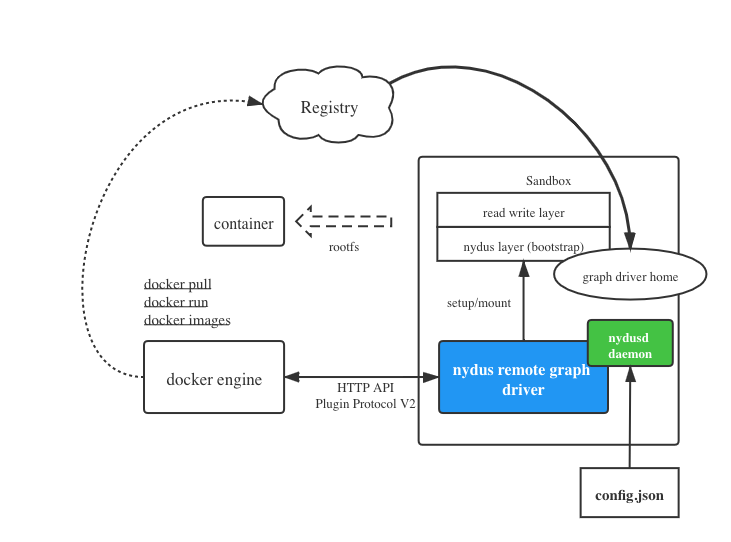
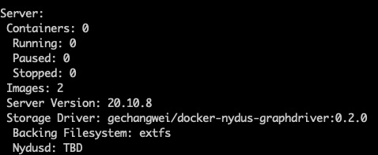

# Docker Nydus Graph Driver

Docker supports remote graph driver as a plugin. With the nydus graph driver, you can start a container from previously converted nydus image. The initial intent to build the graph driver is to provide a way to help users quickly experience the speed starting a container from nydus image. So it is **not ready for productive usage**. If you think docker is important in your use case, a PR is welcomed to listen to your story. We might enhance this in the future.

## Architecture

---



## Procedures

### 1 Configure Nydus

Put your nydus configuration into path `/var/lib/nydus/config.json`, where nydus remote backend is also specified.

### 2 Install Graph Driver Plugin

#### Install from DockerHub

```
$ docker plugin install gechangwei/docker-nydus-graphdriver:0.2.0
```

### 3 Enable the Graph Driver

Before facilitating nydus graph driver to start container, the plugin must be enabled.

```
$ sudo docker plugin enable gechangwei/docker-nydus-graphdriver:0.2.0
```

### 4 Switch to Docker Graph Driver

By default, docker manages all images by build-in `overlay` graph driver which can be switched to another like nydus graph driver by specifying a new one in its
daemon configuration file.

```
{
    "experimental": true,
    "storage-driver": "gechangwei/docker-nydus-graphdriver:0.2.0"
}
```

### 5 Restart Docker Service

```
$ sudo systemctl restart docker
```

## Verification

Execute `docker info` to verify above steps were all done and nydus graph driver works normally.



## Start Container

Now, just `run` container or `pull` image like what you are used to

## Limitation

1. docker's version >=20.10.2. Lower version probably works well, but it is not tested yet
2. When converting images through `nydusify`, backend must be specified as `oss`.
3. Nydus graph driver is not compatible with classic oci images. So you have to switch back to build-in graphdriver to use those images.
