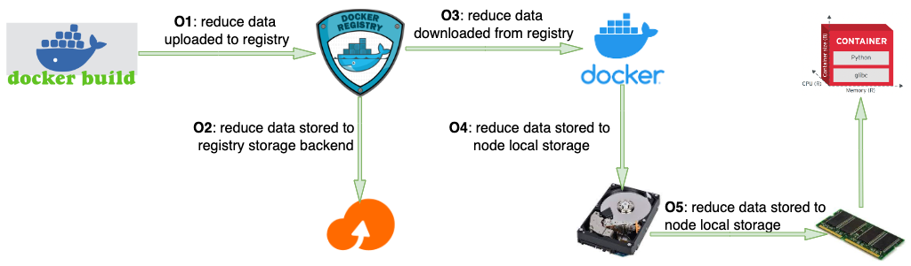

# Overview

A container image contains a packaged application, along with its dependencies, and information on what processes it runs when launched.
Container image provides an immutable and repeatable mechanism to distribute software.
Because every container image packs the application and all its dependencies, common dependencies used by multiple container images may be duplicated multiple times, thus causes heavy data duplication.

The [OCI Image Format Specification V1](https://github.com/opencontainers/image-spec) tries to solve the data duplication issue by using image layers.
A container image may contain one or more image layers, and an image layer may be shared/reused between two container images if and only if:
- the two layers have the same parent layer
- the two layers have identical content

Container image layer helps to reduce duplicated data, but it's not as efficiency as expected due to:
- It's too coarse-grained. Any change of file data or attribute generates a new layer. 
- A layer depends on its parent. They are different layers if two layers have identical content but different parents.
- It depends on the way to generate the container images. In practice, it heavily depends on development workflow to reuse existing layers.

So more fine-grained data deduplication technologies may be used to reduce duplicated content of container images further.

## Data Deduplication
Data deduplication(Dedup) eliminates redundant data at the file- or chunk-level and identifies duplicate contents by their cryptographically secure hash signatures.
Fine-grained data dedup technologies may be classified into different categories. One commonly used classification is:
- File-Level Dedup
- Fixed-Size Chunking Dedup
- Content-Defined Chunking Dedup

### File-Level Deduplication
File-level dedup watches for multiple copies of the same file, stores the first copy, and then just links the other references to the first file. Only one copy gets stored on the disk/tape archive.
Ultimately, the space you save on disk relates to how many copies of the file there were in the file system.
File-level dedup has both pros and cons:
- Pro: smaller index data. Indexes for file-level dedup are significantly smaller, which takes less computational time/memory resource when duplicates are being determined.
- Pro: less computation resource. File-level processes require less processing power due to the smaller index and reduced number of comparisons.
- Con: lower dedup rate. Any change within the file causes the whole file to be saved again.
- Con: not friend to on demand downloading. The whole bigger file must be downloaded to access any byte of the file.
- Con: not friend to Container Registry for garbage-collection.
- Con: not friend to CDN for data cache.

### Fixed-Size Chunking Deduplication
The Fixed-Size Chunking dedup divides file content into fixed-size chunks/slices, and de-duplicates among those data chunks.
Compared with file-level dedup and Content-Defined Chunking(CDC), it's a balanced solution with:
- Mediate dedup rate, higher than file-level dedup, lower than CDC.
- Mediate index data size, bigger than file-level dedup, smaller than CDC.
- Mediate CPU/memory resource consumption when restoring the de-duplicated data.
- Pro: friend to on demand loading and random access.
- Pro: friend to implement in-kernel filesystem.
- Pro: friend to Container Registry for garbage-collection.
- Con: not friend to CDN for data cache.

### Content-Defined Chunking Deduplication
Content-defined chunking (CDC) is a method to split files into variable length chunks, where the cut points are defined by some internal features of the files.
Unlike fixed-length chunks, variable-length chunks are more resistant to byte shifting.
Thus, it increases the probability of finding duplicate chunks within a file and between files.
However, CDC algorithms require additional computation to find the cut points which might be computationally expensive for some applications.
CDC also has Pros/Cons too:
- Pro: higher data dedup rate.
- Pro: friend to on demand loading
- Pro: friend to CDN for data cache.
- Con: bigger index data.
- Con: higher CPU/memory resource consumption when restoring the de-duplicated data.
- Con: not friend to Container Registry.
- Con: not friend to random access.

### Data Deduplication Usage Scenarios
Different data dedup technologies have different Pros/Cons, and may be suitable for different usage scenarios.
The article [FastCDC: a Fast and Efficient Content-Defined Chunking Approach for Data Deduplication](https://www.usenix.org/system/files/conference/atc16/atc16-paper-xia.pdf) states:
```
In general, chunk-level deduplication is more popular than file-level deduplication because it identifies and removes
redundancy at a finer granularity. For chunk-level deduplication, the simplest chunking approach is to cut the file or
data stream into equal, fixed-size chunks, referred to as Fixed-Size Chunking (FSC). Content-Defined Chunking (CDC)
based approaches are proposed to address the boundary-shift problem faced by the FSC approach. Specifically, CDC
declares chunk boundaries based on the byte contents of the data stream instead of on the byte offset, as in FSC,
and thus helps detect more redundancy for deduplication. According to some recent studies, CDC based deduplication
approaches are able to detect about 10-20 percent more redundancy than the FSC approach.
```

A container image is generated once, immutably distributed to many clients, and then accessed by those clients.
Though CDC may achieve higher data deduplication rate, but it consumes more resources when generating and accessing the de-duplicated data.
And FSC dedup also has advantages of being friend to in-kernel fs, on demand loading and registry garbage collection etc.
So we think FSC dedup is the right technology for container image.

## Related Projects
There are several related projects which try to reduce duplicated data in container image/software package by using data dedup technologies.

### casync - Content Addressable Data Synchronizer
The [casync](https://github.com/systemd/casync) project provides a Linux software utility designed to distribute frequently-updated file system images over the Internet. 
It uses Content-Defined Chunking to reduce data transferred to/from the software repositories.

### CernVM-FS
The [CernVM File System](https://cernvm.cern.ch/fs/) project provides a scalable, reliable and low-maintenance software distribution service.
It uses file-level deduplication do reduce data transferred to/from the HTTP server and data stored on local disk.

### OSTree
The [OSTree](https://github.com/ostreedev/ostree) project provides an upgrade system for Linux-based operating systems that performs atomic upgrades of complete filesystem trees.
It uses file-level deduplication do reduce data transferred to/from the HTTP server and data stored on local disk.

# Data Deduplication for Container Images
Data deduplication technologies may be used to reduce data generated, stored, transferred and loaded for container images and/or software packages.
When talking about data deduplication for container images, it may mean different things from different point of view.
For example, it may mean:
- O1: reduce data uploaded to container registries
- O2: reduce data stored in container registry storage backend
- O3: reduce data downloaded from container registries
- O4: reduce data stored on node local storage
- O5: reduce data loaded from node local storage into memory



# Nydus Data Deduplication
The Nydus Image Service project aims to achieve O1, O2, O3, O4 and O5 altogether with two technologies.

First, it develops a new image format, named Rafs (Registry Accelerated File System), which reduces duplicated data by `Fixed-Size Chunking Dedup` at container build time.
Rafs supports configurable chunking size, between 4K to 1M (`2^n, n >= 12 && n <= 20)`.
By default, it reduces duplicated chunks within the same image layer and between layers of the same image. 
It may also reduce duplicated chunks among images if a reference image is given.

Second, it develops a CAS(content addressable storage) system to reduce node-level duplicated data at container runtime.
We are still working on developing a CAS system for Nydus.


## Data Deduplication within an Image Layer

It follows the process to create an image layer from a source filesystem/directory:
- create an image layer bootstrap file
- create an empty image layer data file
- create an empty `ChunkDigestHashTable`
- scan the fs tree and for each filesystem object found:
  - get metadata about the filesystem object, such as type, name, size, permission, owner, atime/ctime etc, and append a metadata entry to the bootstrap file.
  - if the object is a normal file with data,
    - split the file data into fixed-size chunks
    - compute cryptographically secure hash signature for each chunk
    - append the chunk to the data file and add the chunk digest to the `ChunkDigestHashTable` if it doesn't exist in the hash table yet

Finally, we will get one bootstrap file containing all fs metadata and one data file containing de-duplicated data chunks.
So all duplicated data chunks within the same layer will get de-duplicated.

Data dedup within an image layer helps to achieve O1, O2, O3, O4 and O5.

## Data Deduplication within a Multiple Layer Image
When creating the first layer of a multi-layer image, it follows the same process as above.
When creating the following-on layers of a multi-layer image, there's one difference: it reuses the `ChunkDigestHashTable` of parent layer instead creating an empty one.
By this way, all data chunks existing in ancestor layers will get de-duplicated.

Data dedup among multiple image layers helps to achieve O1, O2, O3, O4 and O5.

## Data Deduplication among Multiple Images
A referenced image may be used when creating an image by `nydus-image create --parent-bootstrap referenced-image-bootstrap ...`.
When creating the first layer of an image, and a referenced parent image is present, it reconstructs the `ChunkDigestHashTable` from the reference bootstrap file instead of creating an empty one.
By this way, all data chunks existing in the referenced image will get de-duplicated.
This is most valuable for software upgrading scenario because there may be many duplicated chunks between the existing version and the new version.

Data dedup among multiple images may help to achieve O1, O2, O3, O4 and O5.

## Data Deduplication on Node
The above three methods achieve data dedup during image building stage.
But multi container images may still contain duplicated data chunks, for example:
- images containing the same nodejs library.
- images containing the same java runtime.
 
Even more, a container image may contain duplicated data with the host, say running a Ubuntu 16.04 based image on a Ubuntu 16.04 host.

A node level CAS (content addressable storage) may help to de-duplicate data downloaded from the registry if it already exists in the node CAS system.
When downloading a container image, all data chunks already existing in local CAS will be skipped, and chunks downloaded from the registry will be added to the local CAS system.
So Nydus provides a node level CAS system to reduce data downloaded from the registry and data loaded into memory.

The node level CAS system helps to achieve O4 and O5.

# Node Level CAS System (WIP)
