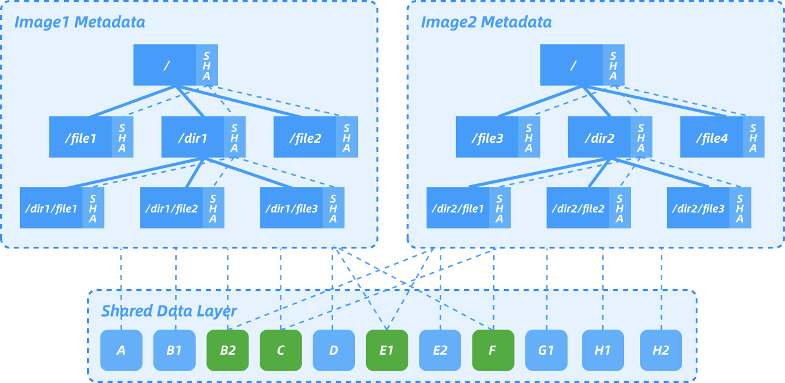

# Nydus

# I. High Level Design
##    0. Overview
Dragonfly image service is named as `nydus`, [github repo](https://github.com/dragonflyoss/image-service)

Nydus consists of two parts,
* a userspace filesystem called `rafs` on top of a container image format
* an image manifest that is compatible with oci spec of image and distribution

Its key features include:

* Container images are downloaded on demand
* Chunk level data deduplication
* Flatten image metadata and data to remove all intermediate layers
* Only usable image data is saved when building a container image
* Only usable image data is downloaded when running a container
* End-to-end image data integrity
* Compatible with the OCI artifacts spec and distribution spec
* Integrated with existing CNCF project Dragonfly to support image distribution in large clusters
* Different container image storage backends are supported

##     1. Architecture
Nydus takes in either [FUSE](https://www.kernel.org/doc/html/latest/filesystems/fuse.html) or [virtiofs](https://virtio-fs.gitlab.io/) protocol to service POD created by conventional runc containers or vm-based [Kata Containers](https://katacontainers.io/). It supports pulling container image data from container image registry, [OSS](https://www.alibabacloud.com/product/oss), NAS, as well as Dragonfly supernode and node peers. It can also optionally use a local directory to cache all container image data to speed up future container creation.


##    2. Rafs
Rafs presents to users a userspace filesystem with seperating filesystem's metadata with data.  In a typical rafs filesystem, the metadata is stored in `bootstrap` while the data is stored in `blobfile`. Nydus splits container image into two parts, metadata and data, where metadata contains everything a container needs to start with, while data is stored in chunk with chunk size being 1MB.



   * bootstrap
      * The metadata is a merkle tree whose nodes represents a regular filesystem's directory/file
      * a leaf nodes refers to a file and contains hash value of its file data
      * Root node and internal nodes refer to directories and contain the hash value of their children nodes.
```
+-----------------+-----------------+--------------+----------------+-------+-------+--------+---------------------+
|                 |                 |              |                |       |       |        |                     |
|OndiskSuperBlock |OndiskInodeTable |PrefetchTable |OndiskBlobTable |node 1 |node 2 | ...... |                     |
|                 |                 |(optional)    |                |       |       |        |                     |
+-----------------+--------------------------------+----------------+-------+-------+--------+---------------------+
```

* node

```
+-------------------+-------+----------------+----------------+
|                   |       |                |                |
|OndiskInodeWrapper |XAttrs |OndiskChunkInfo |......          |
|                   |       |                |                |
+-------------------+-------+----------------+----------------+
```
* OndiskInodeWrapper
```
+------------+-------+-----------+
|            |       |           |
|OndiskInode | name  | symlink   |
|            |       |           |
+------------+-------+-----------+

   ```
   * blob file
```
+------------+-----------+-------------------------------------------------+
|            |           |                                                 |
|chunk_data  |chunk_data |......                                           |
|            |           |                                                 |
+------------+-----------+-------------------------------------------------+
```
   
##    3. Integrity Validation
### 3.1 Metadata Integrity Validation
Firstly, Nydus does basic verification of metadata values, looking for values that are in range (and hence not detected by automated verification checks) but are not correct.

Secondly, as a primary concern, metadata needs some form of overall integrity checking. We cannot trust the metadata if we cannot verify that it has not been changed as a result of external influences. Hence we need some form of integrity check, and this is done by adding one of the two digest validations (Sha256 and blake3) to the metadata.

Validation of the metadata takes place at runtime when metadata is accessed.  By the nature of container image, only read verification is required.

The read verification is doing sanity checking on metadata's fields and determining whether digest validating is necessary.  If it is, the digest is calculated with the chosen hash algorithm and compared against the value stored in the object itself.  If any of these checks fail, then the buffer is considered corrupt and the EINVAL error is set appropriately.
### 3.2  Data Integrity Validation
Data is split into chunks and each chunk has a saved digest in chunk info, the way of metadata digest validation applies to chunk as well.

##    4. Prefetch
As a lazily fetch solution, prefetch plays an important role to mitigate the impact of failing to fetch data after containers run.   In order to do it, we need to record hints in container image about which files and directories need prefetching, according to the information, at runtime nydus daemon will fetch these files and directories in the background into local storage.

The image build tool `nydusify` accepts prefetch hints from `stdin`.
##    5. Blob and Blob Cache
* blob
Blob is the data part of a container image, it consists of files' data.  Nydus has splitted a file's data into one or more fixed-length (1MB) chunks.

* blob cache
Nydus can be configured to set up a cache for blob, called `blobcache`.  With `blobcache`, fetched blob data is saved to a `work dir` and won't be repeatedly fetched.  Given the assumption that only a small portion of image is fetched, there is no cache eviction for `blobcache`.

##    6. Compression
Nydus can be configured to save either compressed chunk or noncompressed chunk, with compressed chunk is the default configuration.

The compression algorithm is lz4 and gzip, `None` stands for noncompression.
```
pub enum Algorithm {
    None,
    LZ4Block,
    GZip,
}
```

# II. Global Structures
   ## 1. Rafs Superblock
   Rafs superblock is located at the first 8K of  the `bootstrap` file.
   ```
   pub struct OndiskSuperBlock {
    /// RAFS super magic
    s_magic: u32,
    /// RAFS version
    s_fs_version: u32,
    /// superblock on disk size
    s_sb_size: u32,
    /// block size
    s_block_size: u32,
    /// superblock flags
    s_flags: u64,
    /// V5: Number of unique inodes(hard link counts as 1).
    s_inodes_count: u64,
    /// V5: Offset of inode table
    s_inode_table_offset: u64,
    /// Those inodes which need to prefetch will have there indexes put into this table.
    /// Then Rafs has a hint to prefetch inodes and doesn't have to load all inodes to page cache
    /// under *direct* metadata mode. It helps save memory usage.
    /// [idx1:u32, idx2:u32, idx3:u32 ...]
    s_prefetch_table_offset: u64,
    /// V5: Offset of blob table
    s_blob_table_offset: u64,
    /// V5: Size of inode table
    s_inode_table_entries: u32,
    s_prefetch_table_entries: u32,
    /// V5: Entries of blob table
    s_blob_table_size: u32,
    s_reserved: u32,
    /// Unused area
    s_reserved2: [u8; RAFS_SUPERBLOCK_RESERVED_SIZE],
}
```

`s_flags` offers several flags to choose which compression algorithm, metadata hash algorithm and xattr will be used.
```
bitflags! {
    pub struct RafsSuperFlags: u64 {
        /// Data chunks are not compressed.
        const COMPRESS_NONE = 0x0000_0001;
        /// Data chunks are compressed with lz4_block.
        const COMPRESS_LZ4_BLOCK = 0x0000_0002;
        /// Use blake3 hash algorithm to calculate digest.
        const DIGESTER_BLAKE3 = 0x0000_0004;
        /// Use sha256 hash algorithm to calculate digest.
        const DIGESTER_SHA256 = 0x0000_0008;
        /// Inode has explicit uid gid fields.
        /// If unset, use nydusd process euid/egid for all
        /// inodes at runtime.
        const EXPLICIT_UID_GID = 0x0000_0010;
        /// Some inode has xattr.
        /// If unset, nydusd may return ENOSYS for getxattr/listxattr
        /// calls.
        const HAS_XATTR = 0x0000_0020;
        // Data chunks are compressed with gzip
        const COMPRESS_GZIP = 0x0000_0040;
    }
}
```

   ## 2. Rafs Inode

   ```
   pub struct OndiskInodeWrapper<'a> {
    pub name: &'a OsStr,
    pub symlink: Option<&'a OsStr>,
    pub inode: &'a OndiskInode,
}
   ```
 
The OndiskInode struct size is padded to 128 bytes.
   
* If it's a directory, all its children is indexed contiguously in `inode table`, and `i_child_index` is the index of  the first child and `i_child_count` is the amount of its children.
* If it's a file, `i_child_index` is not used.
*`i_name_size` is the length of its name.
* `i_symlink_size` is the length of its symlink path.

  
```
   pub struct OndiskInode {
    /// sha256(sha256(chunk) + ...), [char; RAFS_SHA256_LENGTH]
    pub i_digest: RafsDigest, // 32
    /// parent inode number
    pub i_parent: u64,
    /// from fs stat()
    pub i_ino: u64,
    pub i_uid: u32,
    pub i_gid: u32,
    pub i_projid: u32,
    pub i_mode: u32, // 64
    pub i_size: u64,
    pub i_blocks: u64,
    /// HARDLINK | SYMLINK | PREFETCH_HINT
    pub i_flags: RafsInodeFlags,
    pub i_nlink: u32,
    /// for dir, child start index
    pub i_child_index: u32, // 96
    /// for dir, means child count.
    /// for regular file, means chunk info count.
    pub i_child_count: u32,
    /// file name size, [char; i_name_size]
    pub i_name_size: u16,
    /// symlink path size, [char; i_symlink_size]
    pub i_symlink_size: u16, // 104
    pub i_reserved: [u8; 24], // 128
}
   ```

`i_flags` indicates whether the inode is a symlink or a hardlink, whether it has xattr, and whether it has hole between its chunks.

  ```
  bitflags! {
    pub struct RafsInodeFlags: u64 {
        /// Inode is a symlink.
        const SYMLINK = 0x0000_0001;
        /// Inode has hardlinks.
        const HARDLINK = 0x0000_0002;
        /// Inode has extended attributes.
        const XATTR = 0x0000_0004;
        /// Inode chunks has holes.
        const HAS_HOLE = 0x0000_0008;
   }
}
  ```
  `OndiskXAttrs` and xattr are stored right after `OndiskInodeWrapper` in the boostrap file.
 ```
 pub struct OndiskXAttrs {
    pub size: u64,
}
 ```
A list of `OndiskChunkInfo` is also stored after xattr if the inode contains file data.  Each chunk info tells us where to find data in blob file, it contains 
- the hash value `block_id` calculated from the chunk data,
- the blob file it belongs to,
- whether the chunk is compressed,
- whether the chunk has holes,
- the offset in the blob file,
- the file offset.


```
  pub struct OndiskChunkInfo {
    /// sha256(chunk), [char; RAFS_SHA256_LENGTH]
    pub block_id: RafsDigest,
    /// blob index (blob_id = blob_table[blob_index])
    pub blob_index: u32,
    /// chunk flags
    pub flags: RafsChunkFlags,

    /// compressed size in blob
    pub compress_size: u32,
    /// decompressed size in blob
    pub decompress_size: u32,
    /// compressed offset in blob
    pub compress_offset: u64,
    /// decompressed offset in blob
    pub decompress_offset: u64,

    /// offset in file
    pub file_offset: u64,
    /// reserved
    pub reserved: u64,
}

bitflags! {
    pub struct RafsChunkFlags: u32 {
        /// chunk is compressed
        const COMPRESSED = 0x0000_0001;
        const HOLECHUNK = 0x0000_0002;
    }
}
  ```
  
   ## 3. Rafs Inode Table
Inode table is a mapping from inode index to `OndiskInode`, specifically a hardlink file shares the same inode number but has a different inode index.
```
   pub struct OndiskInodeTable {
    pub(crate) data: Vec<u32>,
}
   ```
   ## 4. Rafs Prefetch Table
  This is where we record hints in container image about which files and directories need prefetching upon starting.
```
pub struct PrefetchTable {
    pub inode_indexes: Vec<u32>,
}
   ```
   ## 5. Rafs Blob Table
   Blob table is the mapping from blob index of `OndiskInode` to blob id so that we don't have to record blob id inside `OndiskInode` (note that different inodes' data chunk can reside in the same blob).
```
   pub struct OndiskBlobTableEntry {
    pub readahead_offset: u32,
    pub readahead_size: u32,
    pub blob_id: String,
}

pub struct OndiskBlobTable {
    pub entries: Vec<OndiskBlobTableEntry>,
}
   ```
# III. Manifest of Nydus Format Image
Nydus manifest is designed to be fully compatible with OCI image spec and distribution spec by adding an extra manifest file to store the pointers of nydus bootstrap (i.e. metadata) and blobfile (i.e. data).

  ## 1. Image Index
  A typical image index enabling nydus points to two manifest files, one is the traditional OCIv1 image manifest, the other is the nydus manifest that takes advantage of `platform` and puts `os.features: ["nydus.remoteimage.v1"]` field under `platform`.
  ```
  {
  "schemaVersion": 2,
  "manifests": [
    {
      "mediaType": "application/vnd.docker.distribution.manifest.v2+json",
      "size": 1152,
      "digest": "sha256:c95b7b93ccd48c3bfd97f8cac6d5ca8053ced584c9e8e6431861ca30b0d73114",
      "platform": {
        "architecture": "amd64",
        "os": "linux"
      }
    },
    {
      "mediaType": "application/vnd.oci.image.manifest.v1+json",
      "size": 1072,
      "digest": "sha256:9e2bcf20f78c9ca1a5968a9228d73d85f27846904ddd9f6c10ef2263e13cec4f",
      "platform": {
        "architecture": "amd64",
        "os": "linux",
        "os.features": [
          "nydus.remoteimage.v1"
        ]
      }
    }
  ]
}
  ```
  ## 2. Image Manifest
  A typical image manifest of nydus consists of `config.json`, one nydus metadata layer (`"mediaType": "application/vnd.oci.image.layer.v1.tar.gz"`) and one or more nydus data layers (`"mediaType": "application/vnd.oci.image.layer.nydus.blob.v1"`).
  * nydus metadata layer
  This layer refers to the metadata part of files and directories in the image, including rafs filesystem metadata and digest for validation purpose.
  The special part is that an annotation `"containerd.io/snapshot/nydus-bootstrap": "true"` is set and lets containerd's snapshotter know it's nydus metadata layer and do its job accordingly.
  * nydus data layer
  This layer refers to the data part, please note that the data layers of an image can be owned solely by this image or shared by others, similarly, each data layer is annotated with `"containerd.io/snapshot/nydus-blob": "true"`, which can be used to tell containerd's snapshotter to skip downloading them.
  
  The manifest is designed to be compatible with the dependency architect and garbage collection algorithm widely used by containerd and registry.
  ```
  {
  "schemaVersion": 2,
  "mediaType": "",
  "config": {
    "mediaType": "application/vnd.docker.container.image.v1+json",
    "size": 981,
    "digest": "sha256:a27f27be5546ba699ec38344a3fcbeb92ccfe7bdf0ac13d62ce630dea0178bbd"
  },
  "layers": [
    {
      "mediaType": "application/vnd.oci.image.layer.nydus.blob.v1",
      "size": 51522,
      "digest": "sha256:8a44bc8c2e35502f68d1ad692f7bf247eb9e21dca2742b6b0df58ba7b6a96ef3",
      "annotations": {
        "containerd.io/snapshot/nydus-blob": "true"
      }
    },
    {
      "mediaType": "application/vnd.oci.image.layer.nydus.blob.v1",
      "size": 524,
      "digest": "sha256:1d51ac9ebde626252c1b02fc2d446a5e328eadcb1ca26942bfbd482b5e386e49",
      "annotations": {
        "containerd.io/snapshot/nydus-blob": "true"
      }
    },
    {
      "mediaType": "application/vnd.oci.image.layer.nydus.blob.v1",
      "size": 7,
      "digest": "sha256:00d151e7d392e68e2c756a6fc42640006ddc0a98d37dba3f90a7b73f63188bbd",
      "annotations": {
        "containerd.io/snapshot/nydus-blob": "true"
      }
    },
    {
      "mediaType": "application/vnd.oci.image.layer.v1.tar.gz",
      "size": 664576,
      "digest": "sha256:35bdd331b926eccd78440b0060c8484355ad69a8e6f38290fed4d0a3491ba76e",
      "annotations": {
        "containerd.io/snapshot/nydus-bootstrap": "true"
      }
    }
  ]
}
  ```
