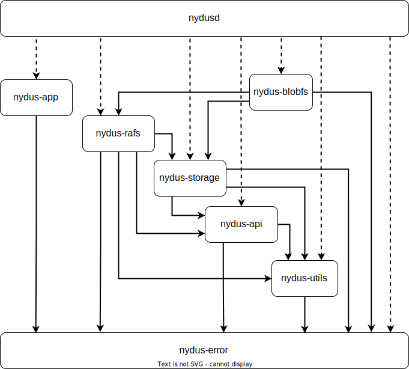

## Architecture Overview

### Crate Dependency

The dependency among Nydus crates are shown below: 

To ease crate publishing process and avoid frequent dependency failures, please follow the rules below to specify dependencies:
- Library crates only specify major and minor version numbers, such as `nydus-error = "0.2"`.
- Binary crates specify major, minor and patch version numbers, such as `nydus-error = "0.2.1"`.

## Storage Subsystem
The storage subsystem is the core of [Nydus Image Service](https://nydus.dev/) project, which caches data fetched from storage backends and provides data services to rafs, blobfs and fscache etc.
The storage subsystem contains several sub-modules:
- API Layer: define external APIs for clients.
  - [BlobFactory](https://docs.rs/nydus-storage/latest/nydus_storage/factory/struct.BlobFactory.html): create and garbage-collect cached blob objects.
  - [BlobDevice](https://docs.rs/nydus-storage/latest/nydus_storage/device/struct.BlobDevice.html) and [BlobIoVec](https://docs.rs/nydus-storage/latest/nydus_storage/device/struct.BlobIoVec.html): provide data services for rafs and blobfs in unit of data chunks.
  - [BlobObject](https://docs.rs/nydus-storage/latest/nydus_storage/device/trait.BlobObject.html): provide data services in unit of address ranges.
- Cache Layer: decompress, decrypt and cache blob data fetched from storage backends.
  - `PrefetchWorker`: workers to prefetch blob data from storage backend in background.
  - [BlobCache](https://docs.rs/nydus-storage/latest/nydus_storage/cache/trait.BlobCache.html): define the core interface to access cached blob object.
  - [DummyCacheMgr](https://docs.rs/nydus-storage/latest/nydus_storage/cache/struct.DummyCacheMgr.html): a dummy cache manager to fetch data from storage backend on demand and never caches data locally.
  - [FileCacheMgr](https://docs.rs/nydus-storage/latest/nydus_storage/cache/struct.FileCacheMgr.html): a generic cache manager to cache data fetched from storage backend by using local files.
  - [FsCacheMgr](https://docs.rs/nydus-storage/latest/nydus_storage/cache/struct.FsCacheMgr.html): a special cache manager to cooperate Linux fscache driver to cache data from storage backend by using local files.
  - [BlobMetaInfo](https://docs.rs/nydus-storage/latest/nydus_storage/meta/struct.BlobMetaInfo.html): blob metadata to support fetch, decompress and decrypt blob data on demand.
- Cache State Layer: track status of local cached blob data.
  - [ChunkMap](https://docs.rs/nydus-storage/latest/nydus_storage/cache/state/trait.ChunkMap.html): maintain data cache status for data chunks.
  - [RangeMap](https://docs.rs/nydus-storage/latest/nydus_storage/cache/state/trait.RangeMap.html): maintain data cache status for data ranges.
- Backend Layer: fetch blob data from storage backends.
  - [BlobBackend](https://docs.rs/nydus-storage/latest/nydus_storage/backend/trait.BlobBackend.html): manager to get access to data blobs from storage backend.
  - [BlobReader](https://docs.rs/nydus-storage/latest/nydus_storage/backend/trait.BlobReader.html): reader to access blob data from storage backend.
  - [LocalFs](https://docs.rs/nydus-storage/latest/nydus_storage/backend/localfs/struct.LocalFs.html): storage backend to access blobs stored in local accessible filesystems, such ext4, xfs, NFS, CephFS, GlusterFS etc.
  - [Oss](https://docs.rs/nydus-storage/latest/nydus_storage/backend/oss/index.html): storage backend to access blobs from object storage systems.
  - [Registry](https://docs.rs/nydus-storage/latest/nydus_storage/backend/registry/index.html): storage backend to access blobs from container image registries.
   

### IO Mode

When the Nydus Image Service is created in 2019, the rust async io ecosystem is still under development.
So the Nydus storage subsystem has used multi-threaded, synchronous IO mode for IO operations.
This mode has several advantages, especially easy to develop and maintain.
But it also has drawbacks too, too many worker threads under heavy loads, hard to use AIO/io uring asynchronous IO framework.

Now the rust async IO ecosystem is much more mature, and is suitable for IO intensive workloads like Nydus.
It uses the most popular tokio async io framework. Tokio supports two types of runtime engines: multi-threaded and current thread.
The tokio multi-threaded Runtime will automatically dispatch work items among worker threads. 
And the tokio current thread Runtime runs pending work items by current thread, and doesn't dispatch work items to different worker threads.

On the other hand, tokio-uring to do asynchronous IO by using io-uring only supports tokio current thread Runtime engine.
Thus tokio current thread Runtime is adopted to support tokio-uring in future. 
And an asynchronous Multi-Producer, Multi-Consumer channel is used to dispatch work items among different tokio current thread Runtimes.

TODO: enable io-uring for asynchronous IO. It's a challenging task due to data buffer lifetime management.

### Blob Data Format (TODO: nydus data blob, stargz data blob, compression algorithms, encryption algorithms, digest algorithms)
