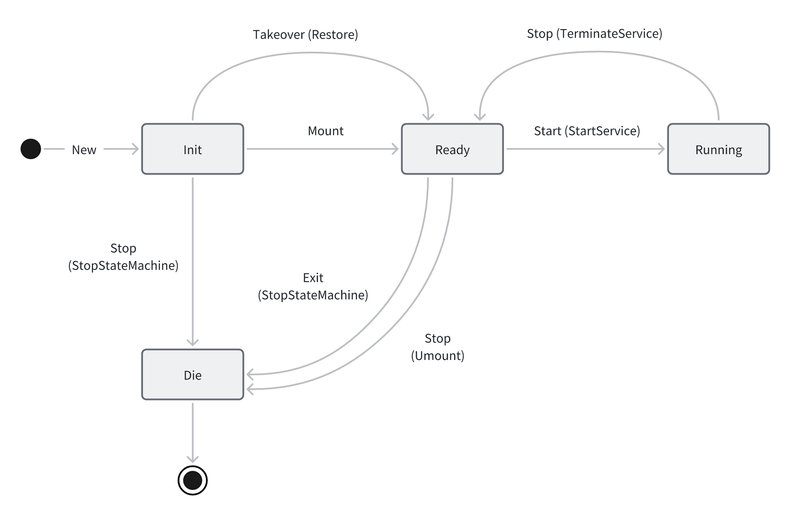

# Nydus Failover and Hot Upgrade

Currently, nydusd supports failover and hot upgrade under fusedev and fscache modes, specifically:

- Nydusd can automatically recover from crashes and continue serving container I/O operations.
- Users can upgrade nydusd without disrupting container I/O operations, once the old nydusd process exits and the new one starts, it can immediately serve container I/O.

[nydus-snapshotter](https://github.com/containerd/nydus-snapshotter.git) already natively supports the above features.

## How to Use

### Failover

Ensure that the `recover_policy` value in the configuration file of nydus-snapshotter is set to `failover`.

```toml
[daemon]
# How to process when daemon dies: "none", "restart" or "failover"
recover_policy = "failover"
```

Then restart the nydus-snapshotter service. In this way, when the nydusd process crashes (for example, OOM Killed), nydus-snapshotter will automatically restart and recover the nydusd process.

### Hot Upgrade

By making an HTTP call to the system unix domain socket exposed by nydus-snapshotter (default is `/run/containerd-nydus/system.sock`), you can upgrade the version of the nydusd binary file used by the nydusd process.

The method and path of this HTTP call are: `PUT /api/v1/nydusd/upgrade`

Example request body:

```json
{
    "nydusd_path": "/path/to/new/nydusd"
}
```

By now only the field `nydusd_path` is required in the request body. More fields (like `version`, `policy`, etc) may be used in the future.

## Design

### State Machine of Nydusd



Under normal circumstances, executing the nydusd binary file will create a new nydusd process. At this time, the process is in the `Init` state. Then nydusd issues a `Mount` command to itself, entering the `Ready` state. Subsequently, an external controller (such as nydus-snapshotter) will call the control interface exposed by nydusd and issue a `Start` command, making nydusd enter the `Running` state.

When an external controller (such as nydus-snapshotter) performs failover or hot upgrade, the command to start a new nydusd process will include the `--upgrade` parameter. Thus, after the new nydusd process starts, it will stay in the `Init` state. The external controller (such as nydus-snapshotter) can then issue a `Takeover` command to the new nydusd process, instructing the new nydusd process to perform a `Restore` operation.

### State Saving and Recovery

#### State Information to be Saved and Recovered

1. File handler. In fusedev mode, it's the fuse file; in fscache mode, it's the file handler which is used to cooperate with the linux fscache driver to manage cached blob objects.

2. State of the backend filesystem. For example, the VFS state in fusedev mode, etc.

#### How to Save and Recover

Usually, after the nydusd process enters the `Running` state, the external controller (such as nydus-snapshotter) will notify the nydusd process to save its state information and return it. For nydus-snapshotter, it provides a unix domain socket path to the nydusd process. Nydusd serializes the state information using [the dbs-snapshot crate](https://github.com/kata-containers/dbs-snapshot) and then sends the serialized byte array, using [the sendfd crate](https://github.com/standard-ai/sendfd) (the fd used here is the File Handler referred to in the previous section), through the unix domain socket path provided by nydus-snapshotter. Nydus-snapshotter will store the received state information byte array in memory.

During recovery, the nydusd process is in the `Init` state. Upon receiving the `Takeover` command from nydus-snapshotter, it will receive the state information saved by the old nydusd process sent by nydus-snapshotter through the unix domain socket path. After receiving the state information, nydusd will deserialize it and use it to restore the backend filesystem.