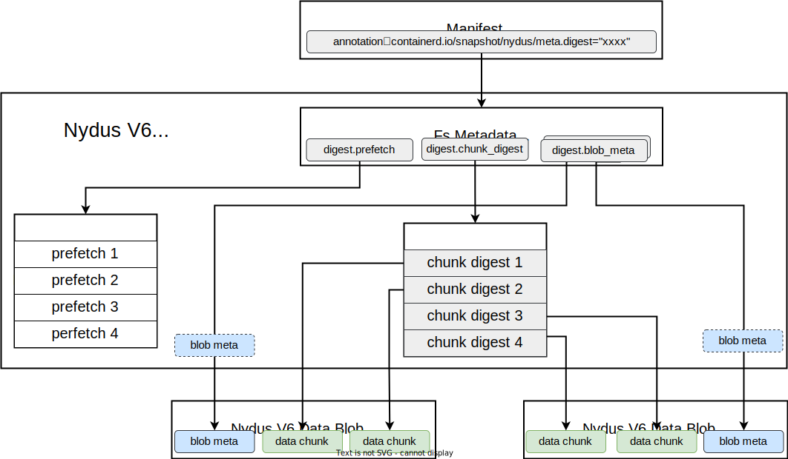

# Content Verification
Container image integrity is crucial for some usage scenarios, such as financial applications, confidential containers etc.
When on-demand downloading is enabled, the integrity of image content can't be verified before starting containers
because not all data have been downloaded yet. So the `Nydus V6 Image Format` has a built-in mechanism to ensure data
integrity at runtime, that is when data is accessed by container applications.

The goal of integrity verification is to ensure all filesystem metadata and file data accessed by container applications
are trusted. The idea is to save digests of metadata/data when generating the image and verify the digest before
accepting the metadata/data when using the image. Luckily the `Nydus V6 Image Format` already saves digests of data
chunks for chunk deduplication, so the overhead is minor to support data integrity verification.

To support on-demand loading of Nydus V6 Image metadata, the `Metadata Blob` is divided into several sections:
- Filesystem Metadata. It's always needed.
- Prefetch Table. It's needed when data prefetching is enabled.
- Chunk Digest Table. It's needed when data integrity verification is enabled.
- Optional Blob Metadata. It's needed when on-demand data loading is enabled.

Note: `Blob Metadata` may be stored in the metadata blob or corresponding data blob.

The overall integrity verification architecture is as below. The trust chain is built as:
- The digest of `Nydus V6 Image Filesystem Metadata` is stored in the image manifest. We assume that the integrity of image manifest has already been verified and is out of topic here.
- The `Nydus V6 Image Filesystem Metadata` contains digest values for `Prefetch Table`, `Chunk Digest Table` and `Blob Metadatas`. Integrity of Prefetch Table, Chunk Digest Table and Blob Metadatas are verified when mounting the filesystem.
- The `Nydus V6 Image Chunk Digest Table` contains digest values for data chunks stored in data blobs. Integrity of data chunks are verified at runtime.

