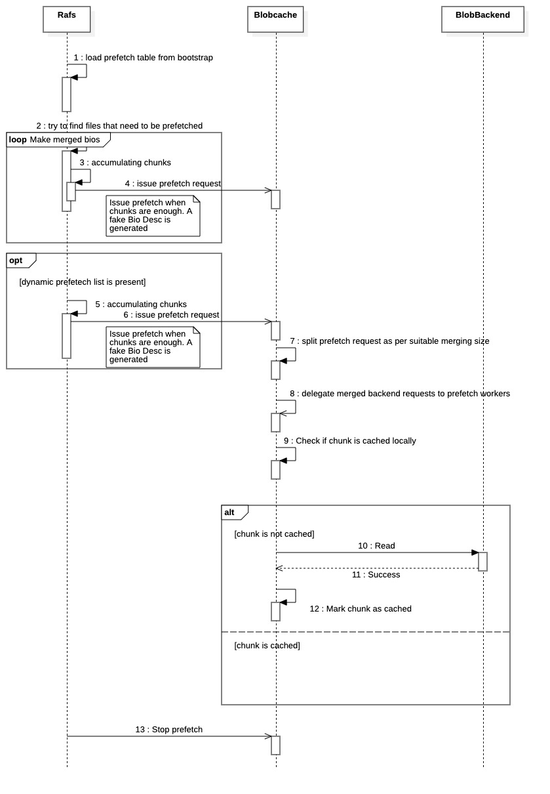

# Cache and Prefetch

Nydus stores blobs in OCI compatible registry, OSS (Aliyun Object Storage Service) and local file system. Regarding to local filesystem storage backend, it doesn't mean blob can only be stored on local disk. It can surely be stored in the NAS device, which can be accessed by Posix file system interfaces.

Nydus divides a single regular file into segments by 1MB size which will be compressed by a configurable compressor like lz4, etc. The compressed segments are called chunk. Chunks are contiguously arranged within a blob file.

The underlying technique of prefetch is that it tries to merge several backend reads into one that spans a wider range. Moreover, users usually know what files are more likely to be read when container starts.

## Prefetch policy:

When converting or creating nydus image, we can add an option to tell `nydus-image` which files should be prefetched when nydusd is started. This is accomplished by option `--prefetch-policy <prefetch-policy>`. Prefetch-policy has 3 possible values:

- fs
- blob
- none

With option `prefetch-policy`, `nydus-image` tries to read stdin to gather a list of files that are proposed to prefetch. The list can have both regular files and directories, even a file belongs to a directory that is also in the same list.

Note that, `fs_prefetch` has to be enabled in rafs configuration file if prefetch is required.

### 1 File System Level

Nydus issues prefetch requests to backend and pulls needed chunks to local storage. So read IO can hit the blobcache which was previously filled by prefetch. Speaking of file system level prefetch, the prefetch request is issued from Rafs layer. So it is easier to better understand about files layout on disk, the relationship between files and directories. Prefetch works on top of file system is born of agility and very nimble.

Prefetch is configurable by Rafs configuration file.

- threads_count

  It has its own background workers to do prefetch. By this parameter, nydus can start different quantity of threads to issue read from backend storage in parallel.

- merging_size

  The upper limit of request size to backend storage. In unit of bytes.

- bandwidth_rate

  In unit of bytes.
  In order to mitigate possible backend bandwidth contention, we can give a bandwidth ratelimit to prefetch. Note that the `bandwidth_rate` sets the limit to the aggregated backend bandwidth consumed by all the threads configured by `threads_count`. So with a lower `bandwidth_rate` limit, more prefetch threads might be meaningless.

A rafs configuration file (only $.fs_prefetch shows, other properties are omitted) follows:

```json
{
  "fs_prefetch": {
    "enable": true,
    "threads_count": 4,
    "merging_size": 131072,
    "bandwidth_rate": 10485760
  }
}
```

#### 1.1 Prefetch Hints

`nydus-image` statically and permanently writes a list of inode numbers to prefetch table of minimal size to bootstrap. The prefetch table will give a hint to nydus when it is mounted how to prefetch files from storage backend.

#### 1.2 Dynamically Specified Files

Thanks to rafs disk layout, even no prefetch hint was given when creating nydus image, we can still provide option `--prefetch-files <prefetch-files>...` to `nydusd`. Afterwards rafs will prefetch those files specified in the list when the mount is initiated. If fortunately enough, rafs tries best to merge backend read requests to reduce latency. A good practice for this is to provide directories which is more possible to get merged to raise prefetch efficiency.
Please be aware of the fact that this method to initiate prefetch does not conflict with "prefetch hints" stored in bootstrap prefetch table. In fact, rafs will firstly try to load prefetch table and then takes the specified files list into account.

#### 1.3 Prefetch policy (future work)

Nydus can now only prefetch data from backend by an explicit hint either from prefetch table or command line starting flag. No globally configured prefetch policy as below is available:

- Prefetch all the blobs entirely from backend slowly and in low priority.
- User IO triggered, block-level readahead.
- Prefetch the parent directory if one of its child is read.

### 2 Blob Level

Not like file system level prefetch, blob level prefetch directly pre-fetches a contiguous region from blob when nydusd started. This prefetch procedure is not aware of files, directories and chunks structures. When creating nydus image, a range descriptor composed of `readahead_offset` and `readahead_length` is written bootstrap. But blob level prefetch **won't** cache any data into blobcache or any other kind of cache. It works at `StorageBackend` level which is lower than `RafsCache`. For now, blob level prefetch only benefits `LocalFs` specific backend. In particular, `LocalFs` backend can perform Linux system call `readahead(2)` to load data from `readahead_offset` up to `readahead_length` bytes.

## Sequence Diagram demonstrating prefetch workflow


