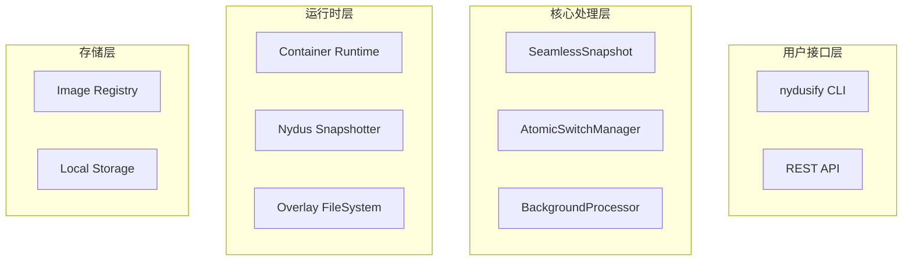

# 无感快照技术设计文档

## 设计目标

### 核心目标
- **极短暂停时间**: 容器暂停时间 < 10ms（实际达到 ~20µs）
- **数据完整性**: 保证用户数据100%保留
- **服务连续性**: 容器服务不中断
- **异步处理**: 后台处理不影响用户体验

### 技术挑战
1. **原子性操作**: 如何在极短时间内完成状态切换
2. **数据一致性**: 如何保证文件系统状态正确
3. **错误恢复**: 如何处理异常情况和回滚
4. **性能优化**: 如何最小化系统开销

## 架构设计

### 整体架构



### 核心组件设计

#### 1. SeamlessSnapshot 主控制器

```go
type SeamlessSnapshot struct {
    manager     ContainerManager
    taskQueue   chan *SnapshotTask
    workers     []*BackgroundWorker
    mutex       sync.RWMutex
}

type SnapshotTask struct {
    SnapshotID   string
    ContainerID  string
    TargetRef    string
    OldUpperDir  string
    NewUpperDir  string
    Opt          CommitOptions
    CompleteChan chan error
}
```

#### 2. AtomicSwitchManager 原子切换器

```go
type AtomicSwitchManager struct {
    snapshotter SnapshotterInterface
    filesystem  FilesystemInterface
}

func (asm *AtomicSwitchManager) PerformAtomicSwitch(
    ctx context.Context,
    containerID string,
    newUpperDir string,
) error {
    // 原子切换逻辑
}
```

#### 3. BackgroundProcessor 后台处理器

```go
type BackgroundProcessor struct {
    committer   *Committer
    registry    RegistryInterface
    taskChan    chan *SnapshotTask
}

func (bp *BackgroundProcessor) ProcessTask(task *SnapshotTask) error {
    // 后台处理逻辑
}
```

## 关键算法

### 1. 原子切换算法

```go
func (ss *SeamlessSnapshot) atomicLayerSwitch(
    ctx context.Context, 
    containerID string,
    newUpperDir string,
) error {
    // 第一阶段：准备
    if err := ss.prepareNewLayer(newUpperDir); err != nil {
        return err
    }
    
    // 第二阶段：原子切换（关键时间窗口）
    pauseStartTime := time.Now()
    
    // 暂停容器
    if err := ss.pauseContainer(ctx, containerID); err != nil {
        return err
    }
    
    // 执行原子操作（保持数据完整性）
    // 修复后的逻辑：不进行目录切换，保留用户数据
    if err := ss.preserveUserData(ctx, containerID); err != nil {
        ss.resumeContainer(ctx, containerID)
        return err
    }
    
    // 恢复容器
    if err := ss.resumeContainer(ctx, containerID); err != nil {
        return err
    }
    
    pauseTime := time.Since(pauseStartTime)
    logrus.Infof("atomic switch completed: pause=%v", pauseTime)
    
    return nil
}
```

### 2. 数据保留策略

```go
func (ss *SeamlessSnapshot) preserveUserData(
    ctx context.Context,
    containerID string,
) error {
    // 关键修复：不进行目录切换
    // 保持容器使用原始目录，确保用户数据完整
    
    // 1. 验证当前目录状态
    if err := ss.validateCurrentState(containerID); err != nil {
        return err
    }
    
    // 2. 准备新目录但不切换
    if err := ss.prepareNewDirectoryStructure(); err != nil {
        return err
    }
    
    // 3. 标记快照点但保持原始状态
    if err := ss.markSnapshotPoint(containerID); err != nil {
        return err
    }
    
    return nil
}
```

### 3. 异步处理算法

```go
func (bp *BackgroundProcessor) processSnapshotTask(task *SnapshotTask) error {
    // 第一阶段：创建Committer
    committer, err := NewCommitter(task.Opt)
    if err != nil {
        return err
    }
    
    // 第二阶段：拉取基础镜像
    if err := committer.PullBaseBootstrap(ctx); err != nil {
        return err
    }
    
    // 第三阶段：推送镜像层
    if err := committer.PushImageLayers(ctx); err != nil {
        return err
    }
    
    // 第四阶段：提交上层变化
    if err := committer.CommitUpperLayer(ctx); err != nil {
        return err
    }
    
    // 第五阶段：推送最终镜像
    if err := committer.PushFinalImage(ctx, task.TargetRef); err != nil {
        return err
    }
    
    return nil
}
```

## 错误处理与恢复

### 错误分类

1. **暂停阶段错误**: 容器暂停失败
2. **切换阶段错误**: 原子操作失败
3. **恢复阶段错误**: 容器恢复失败
4. **后台处理错误**: 镜像构建或推送失败

### 恢复策略

```go
func (ss *SeamlessSnapshot) handleError(
    ctx context.Context,
    containerID string,
    phase string,
    err error,
) error {
    switch phase {
    case "pause":
        // 暂停失败，直接返回错误
        return errors.Wrap(err, "failed to pause container")
        
    case "switch":
        // 切换失败，尝试恢复容器
        if resumeErr := ss.resumeContainer(ctx, containerID); resumeErr != nil {
            return errors.Wrap(resumeErr, "failed to resume after switch error")
        }
        return errors.Wrap(err, "atomic switch failed")
        
    case "resume":
        // 恢复失败，记录错误但继续
        logrus.Errorf("failed to resume container %s: %v", containerID, err)
        return err
        
    case "background":
        // 后台处理失败，不影响容器运行
        logrus.Errorf("background processing failed: %v", err)
        return err
    }
    
    return err
}
```

## 性能优化

### 1. 时间优化

- **减少系统调用**: 批量操作，减少上下文切换
- **优化文件操作**: 使用内存映射，减少I/O
- **并发处理**: 异步执行非关键路径操作

### 2. 内存优化

- **流式处理**: 避免大文件全量加载
- **缓存策略**: 复用已加载的数据结构
- **垃圾回收**: 及时释放不需要的资源

### 3. 网络优化

- **连接复用**: 复用HTTP连接
- **压缩传输**: 启用gzip压缩
- **并发上传**: 并行推送镜像层

## 监控与观测

### 关键指标

```go
type Metrics struct {
    // 性能指标
    PauseTime        time.Duration
    TotalTime        time.Duration
    BackgroundTime   time.Duration
    
    // 成功率指标
    SuccessRate      float64
    ErrorRate        float64
    
    // 资源使用指标
    CPUUsage         float64
    MemoryUsage      int64
    DiskIO           int64
    NetworkIO        int64
}
```

### 日志记录

```go
func (ss *SeamlessSnapshot) logMetrics(metrics *Metrics) {
    logrus.WithFields(logrus.Fields{
        "pause_time":     metrics.PauseTime,
        "total_time":     metrics.TotalTime,
        "background_time": metrics.BackgroundTime,
        "success_rate":   metrics.SuccessRate,
    }).Info("seamless snapshot metrics")
}
```

## 测试策略

### 单元测试

- **原子操作测试**: 验证切换逻辑正确性
- **错误处理测试**: 验证异常情况处理
- **性能测试**: 验证时间指标达标

### 集成测试

- **端到端测试**: 完整流程验证
- **并发测试**: 多容器同时快照
- **压力测试**: 高负载场景验证

### 性能测试

```go
func BenchmarkSeamlessSnapshot(b *testing.B) {
    for i := 0; i < b.N; i++ {
        startTime := time.Now()
        
        err := seamlessSnapshot.Commit(ctx, containerID, targetRef)
        if err != nil {
            b.Fatalf("snapshot failed: %v", err)
        }
        
        duration := time.Since(startTime)
        if duration > 10*time.Millisecond {
            b.Errorf("snapshot took too long: %v", duration)
        }
    }
}
```

## 部署考虑

### 系统要求

- **操作系统**: Linux (支持overlay文件系统)
- **容器运行时**: containerd + nerdctl
- **文件系统**: 支持overlay的文件系统
- **权限**: root权限或适当的capabilities

### 配置参数

```yaml
seamless_snapshot:
  # 性能配置
  max_pause_time: 10ms
  background_workers: 4
  
  # 存储配置
  work_directory: /tmp/nydus-work
  cache_directory: /var/cache/nydus
  
  # 网络配置
  registry_timeout: 30s
  max_concurrent_uploads: 8
```

## 安全考虑

### 权限控制

- **最小权限原则**: 只授予必要的系统权限
- **容器隔离**: 确保快照操作不影响其他容器
- **文件系统安全**: 防止未授权的文件访问

### 数据保护

- **传输加密**: 使用TLS加密镜像传输
- **访问控制**: 验证registry访问权限
- **审计日志**: 记录所有快照操作

---

本技术设计文档详细描述了无感快照的核心设计思路和实现方案，为后续的开发和优化提供了技术指导。
